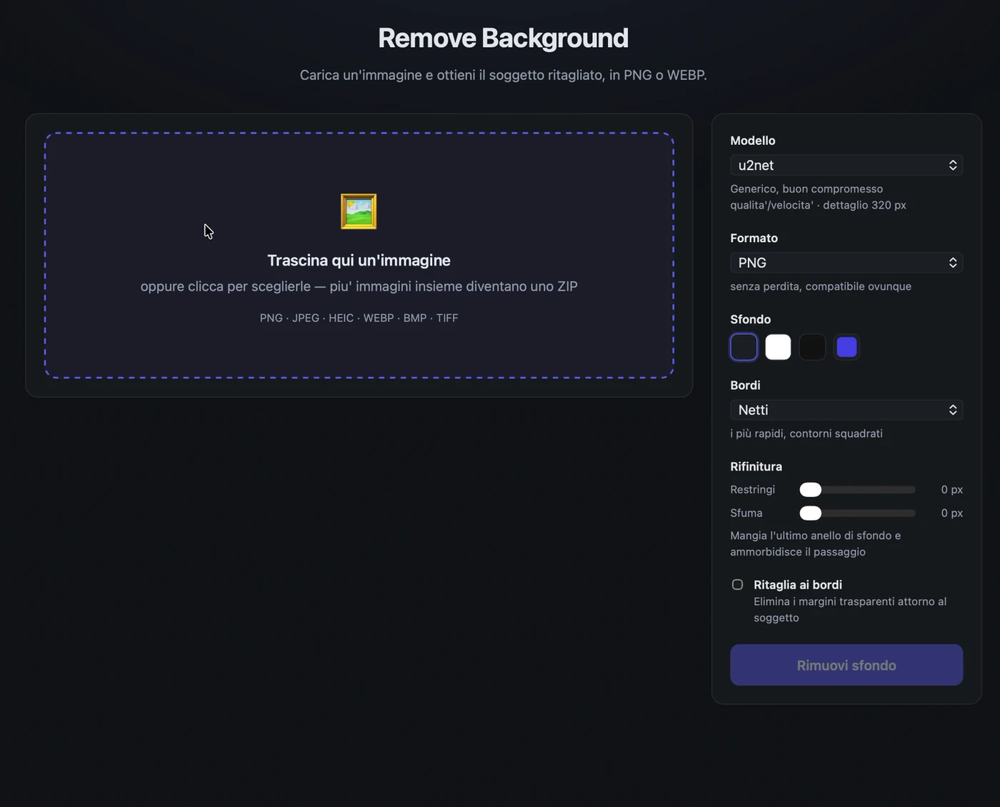
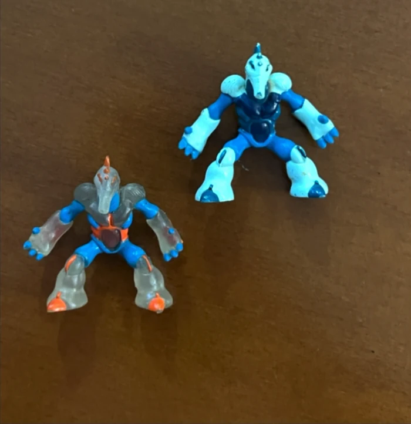
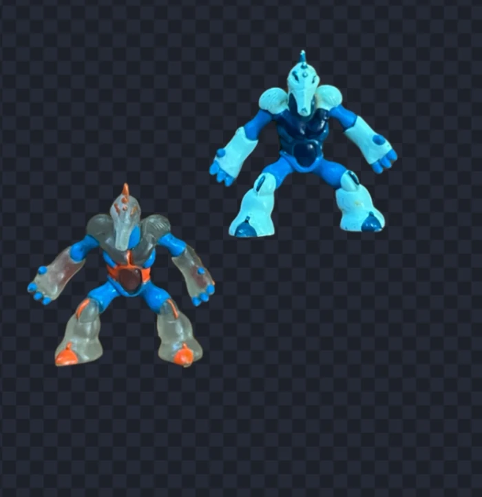
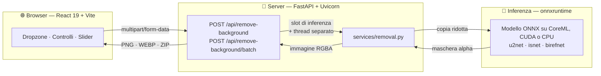

<div align="center">

# 🪄 Remove Background

**Carica un'immagine, ottieni il soggetto ritagliato.**

API Python + interfaccia React. Gira tutto in locale: nessuna chiave, nessun servizio esterno, nessuna immagine che lascia la tua macchina.

[](https://www.python.org/)
[](https://fastapi.tiangolo.com/)
[](https://react.dev/)
[](https://vite.dev/)
[](LICENSE)
[](https://github.com/simonesilvani/photo-remove-background/actions/workflows/ci.yml)

<br>



<sub>Due immagini caricate insieme ed elaborate in blocco, il confronto prima/dopo su
entrambe, e un terzo soggetto ricomposto su uno sfondo pieno. Registrazione dell'app,
senza le pause e leggermente accelerata.</sub>

</div>

---

## ✨ Caratteristiche

### Quello che ci fai

| | |
| :-- | :-- |
| 🖱️ **Carichi come ti pare** | Trascini, clicchi o incolli con <kbd>⌘</kbd>/<kbd>Ctrl</kbd> + <kbd>V</kbd> — anche HEIC dall'iPhone |
| 🎚️ **Vedi la differenza** | Maniglia trascinabile fra originale e ritaglio, con la scacchiera per leggere la trasparenza |
| 🗂️ **Ne fai dieci insieme** | Avanzamento immagine per immagine, ZIP alla fine, e un file rotto non blocca gli altri |
| 🎨 **Scegli lo sfondo** | Trasparente, oppure un colore pieno su cui comporre il soggetto |
| ✂️ **Tagli i margini vuoti** | Un soggetto piccolo in una foto grande esce 364×383 invece di 2000×1500 |
| 📦 **Scegli il peso** | Lo stesso ritaglio pesa **1,3 MB in PNG e 0,15 in WEBP**, con la trasparenza intatta |
| 📋 **Te lo porti via** | Download o copia diretta negli appunti, senza passare dal disco |

### Come si comporta sotto

| | |
| :-- | :-- |
| 🧠 **Sette modelli** | Da `u2netp` (5 MB, 0,33 s) a `birefnet-general` (973 MB): si cambia a ogni richiesta |
| 🎯 **Tre livelli di bordo** | Netti, morbidi senza alone, o alpha matting per capelli e pelo |
| ⚡ **Full-res senza attese** | L'inferenza gira su una copia ridotta, la maschera torna a piena risoluzione: **24 MP in 2 s** |
| 🏎️ **Acceleratore automatico** | CoreML o CUDA se ci sono, CPU altrimenti — senza configurare niente |
| 🛡️ **Memoria con un tetto** | Le inferenze simultanee sono limitate: dodici richieste insieme stanno in 1,6 GB invece di 4,6 |
| 🔒 **Niente esce di lì** | Modelli in locale, nessuna chiave, nessun servizio esterno, nessuna immagine conservata |

<div align="center">





<sub><b>A sinistra</b> le immagini di partenza, <b>a destra</b> lo stesso soggetto dopo la
rimozione: la scacchiera è la trasparenza. Sotto, gli arti in plastica semitrasparente dei
Gormiti — il tipo di bordo su cui i tre livelli si sentono. L'affresco è
<a href="https://commons.wikimedia.org/wiki/File:Michelangelo_-_Creation_of_Adam.jpg">La creazione di Adamo</a>
di Michelangelo, pubblico dominio.</sub>

</div>

---

## 🚀 Avvio rapido

### Con Docker

Un comando solo, senza installare Python o Node:

```bash
docker compose up --build
```

L'app risponde su **http://localhost:8000** — frontend compilato e API nello stesso
processo. I pesi del modello si scaricano al primo avvio in un volume e restano lì.

### Senza Docker

Servono **Python 3.11+**, **Node 18+** e ~700 MB di spazio (venv, node_modules e pesi del
modello), più due terminali.

**1️⃣ Backend** — crea il virtualenv, installa le dipendenze e avvia su `:8000`

```bash
./backend/run.sh
```

> [!NOTE]
> Al primo avvio scarica i pesi di `u2net` (~176 MB) in `~/.rembg/models`, una volta sola;
> poi il modello viene pre-caricato all'avvio, così la prima richiesta non paga l'attesa.
> Per partire con 5 MB invece di 176: `RB_DEFAULT_MODEL=u2netp ./backend/run.sh`.

**2️⃣ Frontend** — dev server su `:5173`, con proxy verso il backend

```bash
npm install --prefix frontend && npm run dev --prefix frontend
```

Apri **http://localhost:5173** e trascina dentro un'immagine.

---

## 🏛️ Architettura



Il frontend parla con il backend attraverso quattro endpoint HTTP: puoi sostituirlo,
incorporarlo in un'altra app o usare l'API da sola.

---

## 🧠 Prestazioni

Le reti di segmentazione lavorano internamente a bassa risoluzione (320×320 per la famiglia
u2net): l'inferenza gira su una **copia ridotta** — lato lungo ≤ 2000 px — e la maschera
torna poi alla dimensione di partenza. Colore e dettagli arrivano sempre dai pixel
originali, quindi il costo cresce **molto meno che linearmente** con i megapixel.

| Risoluzione | Megapixel | Tempo | PNG in uscita |
| :-- | --: | --: | --: |
| 800 × 533 | 0,4 MP | **0,11 s** | 2 KB |
| 1920 × 1280 | 2,5 MP | **0,20 s** | 17 KB |
| 3024 × 4032 | 12,2 MP | **0,48 s** | 1,3 MB |
| 6000 × 4000 | 24,0 MP | **0,67 s** | 2,0 MB |

### Quale modello

Si cambia a ogni richiesta, senza riavviare: `GET /api/models` dice quali sono già sul disco
e quanto pesano quelli che mancano, così l'interfaccia avvisa prima di far partire un
download da centinaia di MB.

| Modello | Peso | Dettaglio | Tempo | Ideale per |
| :-- | --: | --: | --: | :-- |
| `u2netp` | 5 MB | 320 px | **0,33 s** | anteprime rapide, macchine modeste |
| `silueta` | 44 MB | 320 px | **0,37 s** | come u2net, ¼ dello spazio |
| `u2net` ⭐ | 176 MB | 320 px | **0,53 s** | default — soggetti generici |
| `u2net_human_seg` | 176 MB | 320 px | **0,50 s** | persone, ritratti, foto tessera |
| `isnet-anime` | 176 MB | 1024 px | **0,97 s** | illustrazioni, anime, artwork |
| `isnet-general-use` | 179 MB | **1024 px** | **1,00 s** | capelli, rami, oggetti sottili |
| `birefnet-general` | 973 MB | 1024 px | non misurato | qualità massima, molto più lento |

**La colonna "dettaglio" è quella che conta sui contorni fini**: è la risoluzione a cui la
rete guarda l'immagine, e a 320 px una ciocca di capelli semplicemente non esiste. Sulla
stessa foto, `u2net` risolve 10.636 pixel di ciocca e `isnet-general-use` **365.599** —
trentaquattro volte tanto, per il 46% di tempo in più.

> [!TIP]
> Costo di ogni opzione, consumo di RAM, aloni sui bordi, pixel invisibili e confronto fra
> modelli — tutte le misure stanno in **[docs/prestazioni.md](docs/prestazioni.md)**.

<sub>Apple M3 Pro · CPU · mediana di 3 esecuzioni dopo il warm-up.</sub>

---

## 🔌 API

Quattro endpoint HTTP, con Swagger UI su **http://localhost:8000/docs**. Campi, codici di
errore ed esempi stanno in **[docs/api.md](docs/api.md)**.

| Endpoint | Cosa restituisce |
| :-- | :-- |
| `POST /api/remove-background` | l'immagine ritagliata, PNG o WEBP |
| `POST /api/remove-background/batch` | uno ZIP con tutte le immagini elaborate |
| `GET /api/models` | i modelli, con peso e se sono già sul disco |
| `GET /api/health` | stato del servizio e limiti in vigore |

```bash
# sfondo bianco, modello per ritratti, bordi al massimo
curl -F "file=@ritratto.jpg" -F "model=u2net_human_seg" -F "background=#ffffff" \
     -F "edges=max" http://localhost:8000/api/remove-background -o tessera.png
```

---

## ⚙️ Configurazione

Il backend si configura con variabili d'ambiente, nessun file di config da modificare.

| Variabile | Default | Descrizione |
| :-- | :-- | :-- |
| `RB_DEFAULT_MODEL` | `u2net` | modello usato quando il client non ne specifica uno |
| `RB_MAX_UPLOAD_BYTES` | `15728640` | dimensione massima dell'upload (15 MB) |
| `RB_MAX_IMAGE_PIXELS` | `50000000` | tetto ai pixel decodificati (50 Mpixel) |
| `RB_MAX_BATCH_FILES` | `10` | immagini per richiesta in blocco |
| `RB_MAX_BATCH_BYTES` | `62914560` | peso complessivo di una richiesta in blocco (60 MB) |
| `RB_STATIC_DIR` | `frontend/dist` | frontend compilato da servire; se assente, l'API risponde da sola |
| `RB_WEBP_QUALITY` | `92` | qualità del WEBP (la trasparenza resta senza perdita) |
| `RB_CLEAR_INVISIBLE` | `1` | azzera i colori sotto i pixel trasparenti; `0` li lascia |
| `RB_ACCELERATION` | `1` | usa CoreML o CUDA se presenti; `0` forza la CPU |
| `RB_MAX_INFERENCE_SIDE` | `2000` | lato lungo massimo dato in pasto al modello |
| `RB_MAX_CONCURRENCY` | `2` | inferenze simultanee: è il tetto al consumo di RAM |
| `RB_QUEUE_TIMEOUT` | `60` | secondi di attesa in coda prima di rispondere `503` |
| `RB_CORS_ORIGINS` | `http://localhost:5173,http://127.0.0.1:5173` | origini ammesse, separate da virgola |

Lato frontend, `VITE_API_URL` punta l'app a un backend su un altro dominio (in sviluppo
non serve: ci pensa il proxy di Vite).

---

## 🏭 Build di produzione

```bash
npm run build --prefix frontend
```

Genera `frontend/dist/`. Se quella cartella esiste, **il backend la serve da solo** su `/`,
e l'applicazione gira su un unico indirizzo senza bisogno del proxy di Vite né di CORS —
è così che funziona l'immagine Docker. Il percorso si cambia con `RB_STATIC_DIR`.

Per il backend, dietro un reverse proxy:

```bash
./backend/.venv/bin/uvicorn app.main:app --host 0.0.0.0 --port 8000 --workers 2
```

> [!IMPORTANT]
> Ogni worker carica il proprio modello: moltiplica per `--workers` i valori qui sotto, e
> imposta `RB_CORS_ORIGINS` con il dominio reale del frontend.

### Quanta RAM serve

Ogni inferenza in corso costa ~500 MB su una foto da 12 MP, e a contare è il **massimo
simultaneo**, non la media: `RB_MAX_CONCURRENCY` è il tetto. Dodici richieste insieme stanno
in 1,59 GB con il freno e in 4,65 GB senza. Regola pratica: `1` sotto i 2 GB di RAM, il
default `2` fino a 4 GB, oltre si può alzare —
[le misure](docs/prestazioni.md#quanta-ram-serve).

---

## 🧪 Test

Coprono validazione e gestione degli errori — la parte che si rompe più facilmente — e
girano **senza caricare nessun modello**: l'inferenza viene sostituita da uno stub, quindi
la suite finisce in meno di un secondo e non serve scaricare i pesi.

```bash
backend/.venv/bin/pip install -r backend/requirements-dev.txt
backend/.venv/bin/python -m pytest backend
npm test --prefix frontend
```

Gli stessi test girano su GitHub Actions a ogni push e a ogni pull request, su Python 3.11
e 3.13, insieme alla build del frontend: vedi [`.github/workflows/ci.yml`](.github/workflows/ci.yml).

I 38 casi lato backend verificano i codici di errore (`400`, `413`, `415`, `422`), che
`detail` sia sempre una stringa, che il tetto sui pixel scatti prima di allocare memoria,
che le rifiniture agiscano davvero sulla maschera e che i nomi dei file non finiscano nei
log. I 23 lato frontend coprono client HTTP, lettura dei file, appunti e scrittura dello ZIP.

---

## 🔒 Privacy: dove passano le immagini

Il progetto non ha database, cache né cartella di output: **nessuna immagine viene
conservata**. Nel dettaglio, verificato con `lsof` su una richiesta reale:

| Cosa | Dove sta | Quanto resta |
| :-- | :-- | :-- |
| Immagine caricata | RAM del processo; sopra 1 MB Starlette la bufferizza in un file temporaneo | Il tempo della richiesta |
| PNG generato | Solo memoria (`io.BytesIO`), spedito nella risposta HTTP | Mai scritto su disco |
| Anteprima e risultato nel browser | `blob:` URL nella RAM della scheda | Revocati al cambio immagine, persi chiudendo il tab |
| File scaricato | `~/Downloads` | Solo se premi **Scarica PNG** |
| Pesi dei modelli | `~/.rembg/models` | Permanenti (sono i modelli, non le tue foto) |

Quel file temporaneo è **unlinked**: non ha un nome raggiungibile da altri processi e
sparisce a fine richiesta. Nel file che scarichi non resta traccia dello sfondo rimosso — i
pixel invisibili vengono azzerati — e il log registra nome e dimensioni, mai il contenuto:
`INFO foto.jpg (3024x4032) elaborata con u2net in 1.22s`.

> [!WARNING]
> Dietro un reverse proxy la garanzia cambia: **nginx bufferizza gli upload su disco** in
> `client_body_temp_path`, con file veri e propri che restano per la durata della
> richiesta. Se ti serve che le immagini non tocchino mai il disco, imposta
> `proxy_request_buffering off` e verifica la configurazione del tuo proxy.

---

## 📄 Licenza

Distribuito con licenza [MIT](LICENSE).

I modelli di segmentazione sono forniti da
[rembg](https://github.com/danielgatis/rembg) e mantengono le proprie licenze
d'origine — controllale prima di un uso commerciale.


