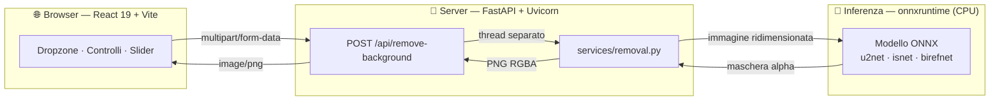
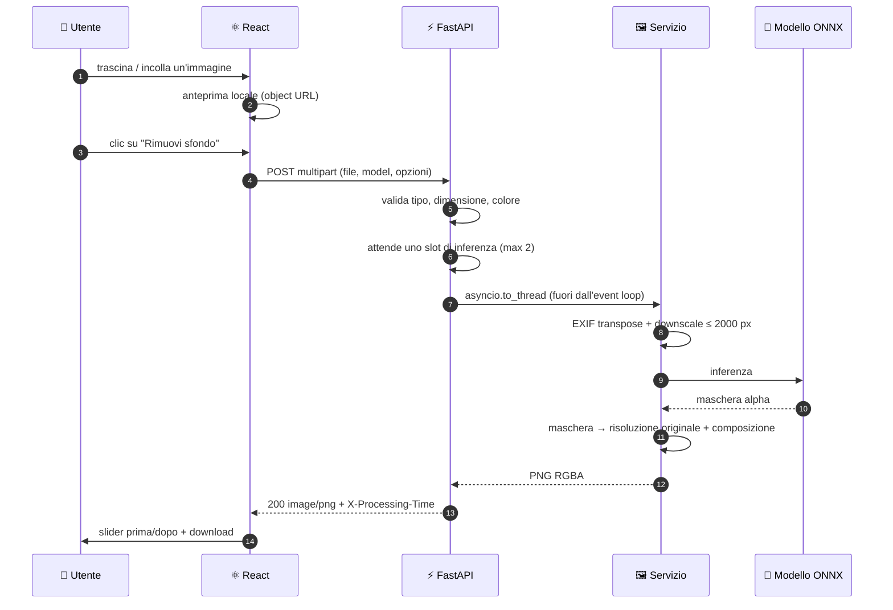
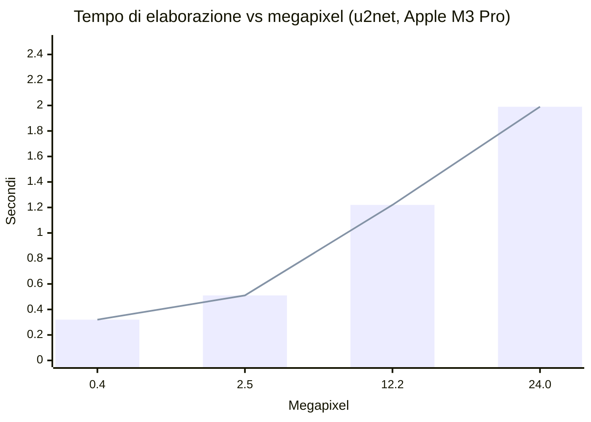

<div align="center">

# 🪄 Remove Background

**Carica un'immagine, ottieni il soggetto ritagliato.**

API Python + interfaccia React. Gira tutto in locale: nessuna chiave, nessun servizio esterno, nessuna immagine che lascia la tua macchina.

[](https://www.python.org/)
[](https://fastapi.tiangolo.com/)
[](https://react.dev/)
[](https://vite.dev/)
[](LICENSE)
[](https://github.com/simonesilvani/photo-remove-background/actions/workflows/ci.yml)

</div>

---

## ✨ Caratteristiche

|  |  |
| :-- | :-- |
| 🖱️ **Tre modi per caricare** | Trascina, clicca o incolla con <kbd>⌘</kbd>/<kbd>Ctrl</kbd> + <kbd>V</kbd> |
| 🎚️ **Confronto prima/dopo** | Slider trascinabile, con scacchiera per leggere la trasparenza |
| 🧠 **7 modelli selezionabili** | Dal più leggero (`u2netp`, 5 MB) al più accurato (`birefnet-general`) |
| 🎨 **Sfondo a scelta** | Trasparente oppure un colore pieno, composto lato server |
| 📦 **PNG o WEBP** | Stesso ritaglio, file fino a 50 volte più leggero |
| 🪶 **Alpha matting** | Bordi morbidi dove servono davvero: capelli, pelo, frange |
| ⚡ **Full-res senza attese** | Inferenza su copia ridotta, maschera riportata sull'originale |
| 🏎️ **Acceleratore automatico** | CoreML o CUDA se disponibili, altrimenti CPU |
| 📐 **EXIF-aware** | Le foto da smartphone non escono ruotate |
| 🛡️ **RAM con un tetto** | Le inferenze simultanee sono limitate: il consumo non esplode sotto carico |
| 🔒 **100% offline** | `onnxruntime` in locale: nessun upload verso terze parti |

---

## 🏛️ Architettura



Il frontend parla con il backend attraverso tre soli endpoint HTTP: puoi sostituirlo,
incorporarlo in un'altra app o usare l'API da sola.

---

## 🚀 Avvio rapido

Servono **Python 3.11+**, **Node 18+** e ~700 MB di spazio (venv, node_modules e pesi del
modello), più due terminali.

**1️⃣ Backend** — crea il virtualenv, installa le dipendenze e avvia su `:8000`

```bash
./backend/run.sh
```

> [!NOTE]
> Al primo avvio scarica i pesi di `u2net` (~176 MB) in `~/.rembg/models`, una volta sola;
> poi il modello viene pre-caricato all'avvio, così la prima richiesta non paga l'attesa.
> Per partire con 5 MB invece di 176: `RB_DEFAULT_MODEL=u2netp ./backend/run.sh`.

**2️⃣ Frontend** — dev server su `:5173`, con proxy verso il backend

```bash
npm install --prefix frontend && npm run dev --prefix frontend
```

Apri **http://localhost:5173** e trascina dentro un'immagine.

---

<details>
<summary><b>🔄 Anatomia di una richiesta</b> — cosa succede fra il drop del file e il PNG</summary>



</details>

---

## 🧠 Modelli e prestazioni

Il modello si sceglie a ogni richiesta: nessun riavvio, i pesi restano in cache.
`GET /api/models` dice quali sono già sul disco e quanto pesano quelli che mancano,
così l'interfaccia avvisa prima di far partire un download da centinaia di MB.

| Modello | Peso | Tempo | Velocità relativa | Ideale per |
| :-- | --: | --: | :-- | :-- |
| `u2netp` | 5 MB | **0,33 s** | `███████░░░░░░░░░░░░░` | anteprime rapide, macchine modeste |
| `silueta` | 44 MB | **0,37 s** | `███████░░░░░░░░░░░░░` | stessa resa di u2net, ¼ dello spazio |
| `u2net` ⭐ | 176 MB | **0,53 s** | `███████████░░░░░░░░░` | default — soggetti generici |
| `u2net_human_seg` | 176 MB | **0,50 s** | `██████████░░░░░░░░░░` | persone, ritratti, foto tessera |
| `isnet-anime` | 176 MB | **0,97 s** | `███████████████████░` | illustrazioni, anime, artwork |
| `isnet-general-use` | 179 MB | **1,00 s** | `████████████████████` | bordi complessi, soggetti sottili |
| `birefnet-general` | 973 MB | non misurato | — | qualità massima, molto più lento |

<sub>Apple M3 Pro · CPU · immagine 1920×1280 con texture · mediana di 3 esecuzioni dopo il warm-up.</sub>

**Alpha matting** rifinisce i bordi semi-trasparenti a un costo contenuto: con `u2net` la
stessa immagine passa da **0,53 s** a **1,07 s**. Serve su capelli, pelo e tessuti sottili;
su soggetti dai bordi netti non cambia il risultato.

**L'acceleratore hardware viene usato da solo se c'è.** All'avvio il server cerca CoreML
(Mac Apple Silicon) o CUDA (GPU NVIDIA) e ricade sulla CPU se non li trova, senza
configurazione. Su un M3 Pro la stessa foto da 12 MP passa da **1,03 s a 0,84 s**, e
l'inferenza da sola quasi raddoppia di velocità (0,40 s → 0,21 s). Il provider scelto
compare nei log all'avvio.

**Il formato di uscita pesa più del modello.** Sulla stessa foto da 12 MP:

| Formato | Tempo totale | File prodotto |
| :-- | --: | --: |
| PNG (default, senza perdita) | 1,40 s | **18,8 MB** |
| WEBP | 1,03 s | **0,36 MB** |

Il canale alpha resta **identico bit per bit** — la compressione agisce solo sui colori — e
sui pixel visibili la differenza media è di 0,33 su 255, cioè invisibile. Il PNG resta il
default perché è senza perdita e lo apre qualunque programma.

> [!TIP]
> Cerchi il modello più leggero da distribuire? `silueta` pesa **¼** di `u2net` con tempi
> praticamente identici. Cerchi il più veloce da scaricare? `u2netp`: 5 MB.

---

## 📐 Come vengono gestite le immagini grandi

Le reti di segmentazione lavorano internamente a bassa risoluzione (320×320 per la
famiglia u2net), quindi l'inferenza gira su una **copia ridotta** (lato lungo ≤ 2000 px) e
la maschera alpha viene poi riportata alla dimensione di partenza. Colore e dettagli
arrivano sempre dai pixel originali: a essere ridimensionata è solo la maschera.

Il costo cresce così **molto meno che linearmente** con i megapixel — a scalare è solo il
lavoro sui pixel, non l'inferenza.

| Risoluzione | Megapixel | Tempo | | PNG in uscita |
| :-- | --: | --: | :-- | --: |
| 800 × 533 | 0,4 MP | **0,32 s** | `███░░░░░░░░░░░░░░░░░` | 0,5 MB |
| 1920 × 1280 | 2,5 MP | **0,51 s** | `█████░░░░░░░░░░░░░░░` | 3,1 MB |
| 3024 × 4032 | 12,2 MP | **1,22 s** | `████████████░░░░░░░░` | 15,1 MB |
| 6000 × 4000 | 24,0 MP | **1,99 s** | `████████████████████` | 29,6 MB |



<sub>Immagini sintetiche ad alto dettaglio, il caso peggiore per la codifica PNG — che
resta la voce di costo dominante: l'inferenza è ~0,4 s a qualsiasi risoluzione.</sub>

> [!NOTE]
> Il limite di 15 MB sull'upload non protegge da niente: un PNG di **388 KB** può
> decodificare 121 Mpixel e occupare ~900 MB di RAM. Il controllo vero è
> `RB_MAX_IMAGE_PIXELS` (50 Mpixel), verificato sull'intestazione del file prima che i
> pixel vengano allocati — richieste simili vengono respinte con `413` in pochi
> millisecondi e a memoria invariata.

---

## 🔌 API

Documentazione interattiva (Swagger UI) su **http://localhost:8000/docs**.

### `POST /api/remove-background`

Corpo `multipart/form-data`:

| Campo | Tipo | Default | Descrizione |
| :-- | :-- | :-- | :-- |
| `file` | file | — | PNG, JPEG, WEBP, BMP o TIFF · max 15 MB e 50 Mpixel |
| `model` | string | `u2net` | uno degli id restituiti da `/api/models` |
| `alpha_matting` | bool | `false` | rifinisce i bordi semi-trasparenti |
| `background` | string | — | colore esadecimale (`#fff`, `#ffffff`, `#ffffffaa`); se assente lo sfondo resta trasparente |
| `format` | string | `png` | `png` (senza perdita) o `webp` (molto più leggero) |

**Risposta** `200 image/png`, più gli header `X-Processing-Time` (secondi),
`X-Image-Width` e `X-Image-Height`.

```bash
# sfondo trasparente
curl -F "file=@foto.jpg" http://localhost:8000/api/remove-background -o out.png

# sfondo bianco, modello per ritratti, bordi rifiniti
curl -F "file=@ritratto.jpg" -F "model=u2net_human_seg" -F "background=#ffffff" \
     -F "alpha_matting=true" http://localhost:8000/api/remove-background -o tessera.png
```

<details>
<summary>Lo stesso da Python, con <code>requests</code></summary>

```python
import requests

with open("foto.jpg", "rb") as f:
    r = requests.post(
        "http://localhost:8000/api/remove-background",
        files={"file": ("foto.jpg", f, "image/jpeg")},
        data={"model": "u2net", "alpha_matting": "false"},
        timeout=120,
    )
r.raise_for_status()
open("out.png", "wb").write(r.content)
print(r.headers["X-Processing-Time"], "secondi")
```
</details>

**Errori** — sempre JSON nella forma `{"detail": "..."}`, con `detail` sempre stringa
(anche per gli errori di validazione, che FastAPI restituirebbe come lista di oggetti):

| Codice | Quando |
| :-- | :-- |
| `400` | file vuoto, immagine illeggibile, modello, colore o formato non valido |
| `413` | file oltre il limite di upload, oppure immagine oltre `RB_MAX_IMAGE_PIXELS` |
| `415` | content-type non supportato |
| `422` | richiesta malformata: campo mancante o non interpretabile |
| `500` | errore inatteso durante l'elaborazione (loggato lato server) |
| `503` | coda di inferenza satura oltre `RB_QUEUE_TIMEOUT`; la risposta include `Retry-After` |

### `GET /api/models` · `GET /api/health`

Rispettivamente l'elenco dei modelli disponibili con una descrizione e il modello di
default, e lo stato del servizio: `{"status": "ok", "default_model": "u2net"}`.

---

## ⚙️ Configurazione

Il backend si configura con variabili d'ambiente, nessun file di config da modificare.

| Variabile | Default | Descrizione |
| :-- | :-- | :-- |
| `RB_DEFAULT_MODEL` | `u2net` | modello usato quando il client non ne specifica uno |
| `RB_MAX_UPLOAD_BYTES` | `15728640` | dimensione massima dell'upload (15 MB) |
| `RB_MAX_IMAGE_PIXELS` | `50000000` | tetto ai pixel decodificati (50 Mpixel) |
| `RB_WEBP_QUALITY` | `92` | qualità del WEBP (la trasparenza resta senza perdita) |
| `RB_ACCELERATION` | `1` | usa CoreML o CUDA se presenti; `0` forza la CPU |
| `RB_MAX_INFERENCE_SIDE` | `2000` | lato lungo massimo dato in pasto al modello |
| `RB_MAX_CONCURRENCY` | `2` | inferenze simultanee: è il tetto al consumo di RAM |
| `RB_QUEUE_TIMEOUT` | `60` | secondi di attesa in coda prima di rispondere `503` |
| `RB_CORS_ORIGINS` | `http://localhost:5173,http://127.0.0.1:5173` | origini ammesse, separate da virgola |

Lato frontend, `VITE_API_URL` punta l'app a un backend su un altro dominio (in sviluppo
non serve: ci pensa il proxy di Vite).

---

## 🏭 Build di produzione

```bash
npm run build --prefix frontend
```

Genera `frontend/dist/`, servibile da qualsiasi web server statico. Per il backend, dietro
un reverse proxy:

```bash
./backend/.venv/bin/uvicorn app.main:app --host 0.0.0.0 --port 8000 --workers 2
```

> [!IMPORTANT]
> Ogni worker carica il proprio modello: moltiplica per `--workers` i valori qui sotto, e
> imposta `RB_CORS_ORIGINS` con il dominio reale del frontend.

### Quanta RAM serve

Ogni inferenza in corso costa ~500 MB su una foto da 12 MP, e il picco non viene più
restituito al sistema operativo: a contare è il **massimo simultaneo**, non la media. Per
questo `RB_MAX_CONCURRENCY` limita le inferenze parallele; le richieste in eccesso
aspettano il turno e ricevono `503` solo se la coda non si smaltisce entro
`RB_QUEUE_TIMEOUT`.

| Carico (foto da 12 MP) | RSS del processo |
| :-- | --: |
| A riposo, con `u2net` caricato | 410 MB |
| 1 inferenza in corso | 824 MB |
| 2 in corso (il default) | 1,46 GB |
| 12 richieste insieme, `RB_MAX_CONCURRENCY=2` | **1,59 GB** |
| 12 richieste insieme, senza freno | **4,65 GB** |

Le stesse 12 richieste, tutte servite con esito `200` in entrambi i casi: il freno scambia
**un terzo della memoria** con il doppio del tempo di smaltimento della coda (10,1 s contro
4,3 s). Regola pratica: `RB_MAX_CONCURRENCY=1` sotto i 2 GB di RAM, il default `2` fino a
4 GB, oltre si può alzare.

---

## 🧪 Test

Coprono validazione e gestione degli errori — la parte che si rompe più facilmente — e
girano **senza caricare nessun modello**: l'inferenza viene sostituita da uno stub, quindi
la suite finisce in meno di un secondo e non serve scaricare i pesi.

```bash
backend/.venv/bin/pip install -r backend/requirements-dev.txt
backend/.venv/bin/python -m pytest backend
npm test --prefix frontend
```

Gli stessi test girano su GitHub Actions a ogni push e a ogni pull request, su Python 3.11
e 3.13, insieme alla build del frontend: vedi [`.github/workflows/ci.yml`](.github/workflows/ci.yml).

I 18 casi lato backend verificano i codici di errore (`400`, `413`, `415`, `422`), che
`detail` sia sempre una stringa, che il tetto sui pixel scatti prima di allocare memoria e
che i nomi dei file caricati non finiscano nei log. I 6 lato frontend coprono il client
HTTP: timeout, annullamento, e la normalizzazione dei messaggi d'errore.

---

## 🔒 Privacy: dove passano le immagini

Il progetto non ha database, cache né cartella di output: **nessuna immagine viene
conservata**. Nel dettaglio, verificato con `lsof` su una richiesta reale:

| Cosa | Dove sta | Quanto resta |
| :-- | :-- | :-- |
| Immagine caricata | RAM del processo; sopra 1 MB Starlette la bufferizza in un file temporaneo | Il tempo della richiesta |
| PNG generato | Solo memoria (`io.BytesIO`), spedito nella risposta HTTP | Mai scritto su disco |
| Anteprima e risultato nel browser | `blob:` URL nella RAM della scheda | Revocati al cambio immagine, persi chiudendo il tab |
| File scaricato | `~/Downloads` | Solo se premi **Scarica PNG** |
| Pesi dei modelli | `~/.rembg/models` | Permanenti (sono i modelli, non le tue foto) |

Quel file temporaneo è **unlinked**: non compare elencando la cartella, non ha un nome
raggiungibile da altri processi e sparisce a fine richiesta — anche se il server venisse
ucciso a metà, lo spazio viene recuperato alla chiusura del processo.

Il log registra **nome e dimensioni** del file, mai il contenuto:
`INFO foto.jpg (3024x4032) elaborata con u2net in 1.22s`.

> [!WARNING]
> Dietro un reverse proxy la garanzia cambia: **nginx bufferizza gli upload su disco** in
> `client_body_temp_path`, con file veri e propri che restano per la durata della
> richiesta. Se ti serve che le immagini non tocchino mai il disco, imposta
> `proxy_request_buffering off` e verifica la configurazione del tuo proxy.

---

## 📄 Licenza

Distribuito con licenza [MIT](LICENSE).

I modelli di segmentazione sono forniti da
[rembg](https://github.com/danielgatis/rembg) e mantengono le proprie licenze
d'origine — controllale prima di un uso commerciale.


