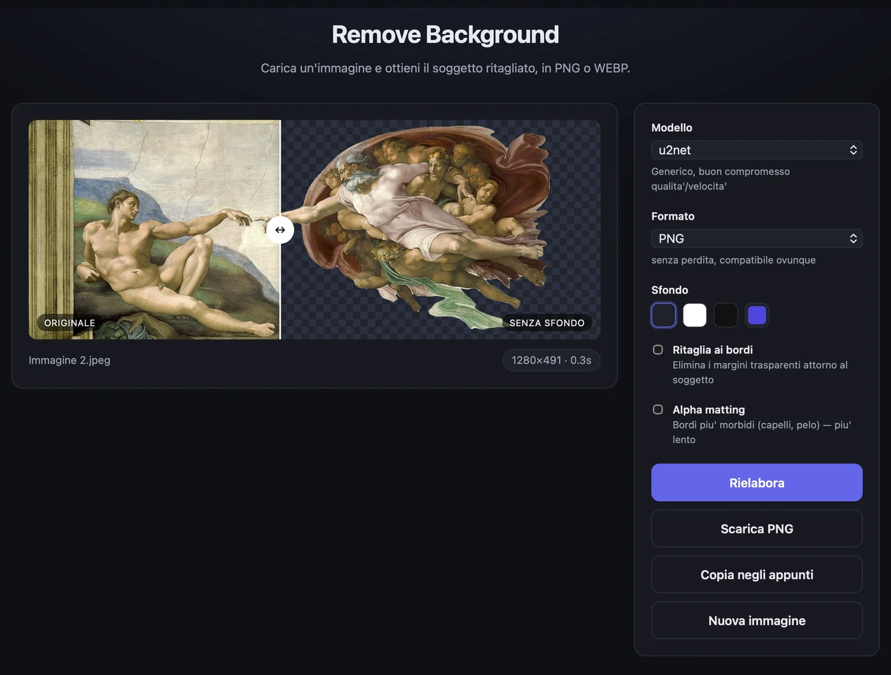
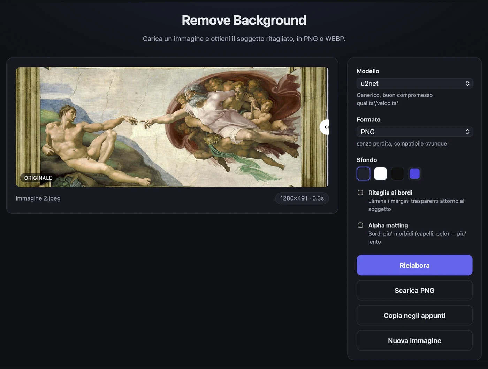
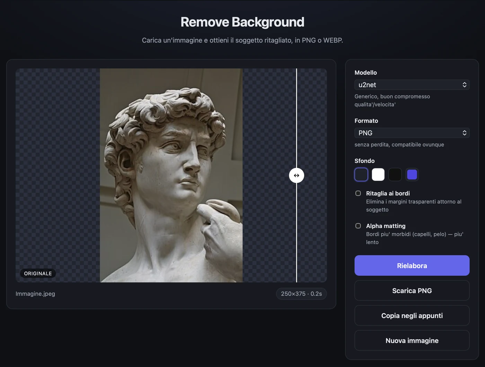
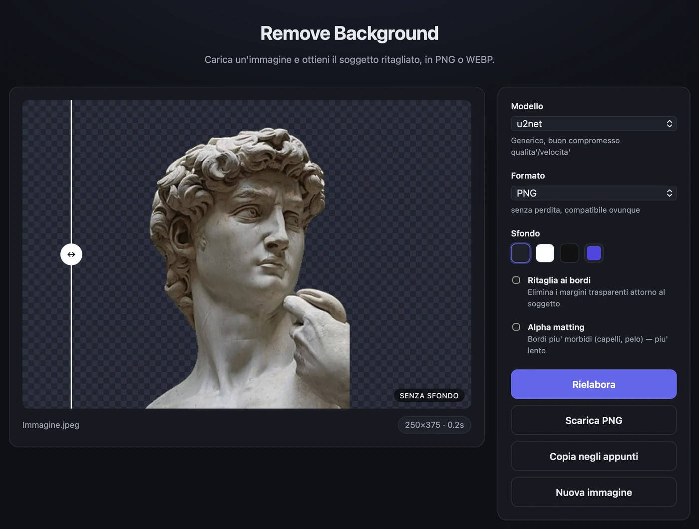
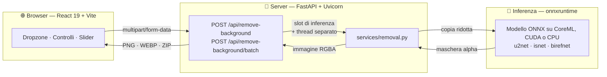
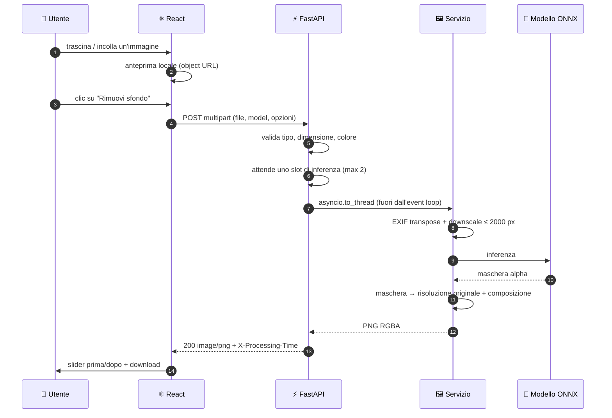
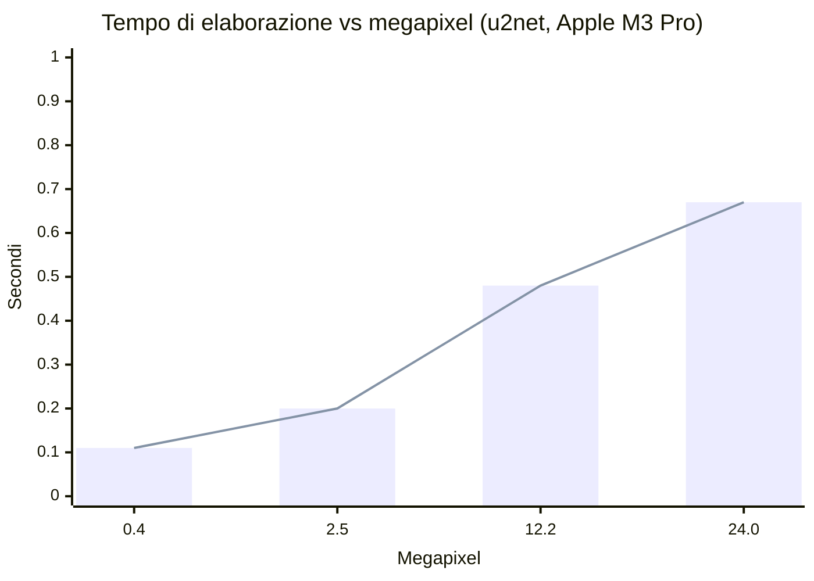

<div align="center">

# 🪄 Remove Background

**Carica un'immagine, ottieni il soggetto ritagliato.**

API Python + interfaccia React. Gira tutto in locale: nessuna chiave, nessun servizio esterno, nessuna immagine che lascia la tua macchina.

[](https://www.python.org/)
[](https://fastapi.tiangolo.com/)
[](https://react.dev/)
[](https://vite.dev/)
[](LICENSE)
[](https://github.com/simonesilvani/photo-remove-background/actions/workflows/ci.yml)

<br>



<sub>Trascina la maniglia per confrontare originale e risultato. L'immagine è
<a href="https://commons.wikimedia.org/wiki/File:Michelangelo_-_Creation_of_Adam.jpg">La creazione di Adamo</a> di Michelangelo, pubblico dominio.</sub>

</div>

---

## ✨ Caratteristiche

### Quello che ci fai

| | |
| :-- | :-- |
| 🖱️ **Carichi come ti pare** | Trascini, clicchi o incolli con <kbd>⌘</kbd>/<kbd>Ctrl</kbd> + <kbd>V</kbd> — anche HEIC dall'iPhone |
| 🎚️ **Vedi la differenza** | Maniglia trascinabile fra originale e ritaglio, con la scacchiera per leggere la trasparenza |
| 🗂️ **Ne fai dieci insieme** | Avanzamento immagine per immagine, ZIP alla fine, e un file rotto non blocca gli altri |
| 🎨 **Scegli lo sfondo** | Trasparente, oppure un colore pieno su cui comporre il soggetto |
| ✂️ **Tagli i margini vuoti** | Un soggetto piccolo in una foto grande esce 364×383 invece di 2000×1500 |
| 📦 **Scegli il peso** | Lo stesso ritaglio pesa **1,3 MB in PNG e 0,15 in WEBP**, con la trasparenza intatta |
| 📋 **Te lo porti via** | Download o copia diretta negli appunti, senza passare dal disco |

### Come si comporta sotto

| | |
| :-- | :-- |
| 🧠 **Sette modelli** | Da `u2netp` (5 MB, 0,33 s) a `birefnet-general` (973 MB): si cambia a ogni richiesta |
| 🎯 **Tre livelli di bordo** | Netti, morbidi senza alone, o alpha matting per capelli e pelo |
| ⚡ **Full-res senza attese** | L'inferenza gira su una copia ridotta, la maschera torna a piena risoluzione: **24 MP in 2 s** |
| 🏎️ **Acceleratore automatico** | CoreML o CUDA se ci sono, CPU altrimenti — senza configurare niente |
| 🛡️ **Memoria con un tetto** | Le inferenze simultanee sono limitate: dodici richieste insieme stanno in 1,6 GB invece di 4,6 |
| 🔒 **Niente esce di lì** | Modelli in locale, nessuna chiave, nessun servizio esterno, nessuna immagine conservata |

<div align="center">






<sub><b>Sopra</b> le immagini di partenza, <b>sotto</b> lo stesso soggetto dopo la
rimozione: la scacchiera è la trasparenza. A destra i riccioli dei capelli, il caso in cui
l'alpha matting fa la differenza.</sub>

</div>

---

## 🚀 Avvio rapido

### Con Docker

Un comando solo, senza installare Python o Node:

```bash
docker compose up --build
```

L'app risponde su **http://localhost:8000**: l'immagine contiene il frontend già compilato
e l'API nello stesso processo. I pesi del modello si scaricano al primo avvio in un volume,
quindi restano lì fra un riavvio e l'altro.

### Senza Docker

Servono **Python 3.11+**, **Node 18+** e ~700 MB di spazio (venv, node_modules e pesi del
modello), più due terminali.

**1️⃣ Backend** — crea il virtualenv, installa le dipendenze e avvia su `:8000`

```bash
./backend/run.sh
```

> [!NOTE]
> Al primo avvio scarica i pesi di `u2net` (~176 MB) in `~/.rembg/models`, una volta sola;
> poi il modello viene pre-caricato all'avvio, così la prima richiesta non paga l'attesa.
> Per partire con 5 MB invece di 176: `RB_DEFAULT_MODEL=u2netp ./backend/run.sh`.

**2️⃣ Frontend** — dev server su `:5173`, con proxy verso il backend

```bash
npm install --prefix frontend && npm run dev --prefix frontend
```

Apri **http://localhost:5173** e trascina dentro un'immagine.

---

## 🏛️ Architettura



Il frontend parla con il backend attraverso quattro endpoint HTTP: puoi sostituirlo,
incorporarlo in un'altra app o usare l'API da sola. In produzione lo stesso processo
serve anche il frontend compilato, quindi l'applicazione gira su un solo indirizzo.

---

<details>
<summary><b>🔄 Anatomia di una richiesta</b> — cosa succede fra il drop del file e il PNG</summary>



</details>

---

## 🧠 Prestazioni

Le reti di segmentazione lavorano internamente a bassa risoluzione (320×320 per la famiglia
u2net): l'inferenza gira su una **copia ridotta** — lato lungo ≤ 2000 px — e la maschera
torna poi alla dimensione di partenza. Colore e dettagli arrivano sempre dai pixel
originali, a essere ridimensionata è solo la maschera. Per questo il costo cresce **molto
meno che linearmente** con i megapixel: a scalare è il lavoro sui pixel, non l'inferenza.

| Risoluzione | Megapixel | Tempo | PNG in uscita |
| :-- | --: | --: | --: |
| 800 × 533 | 0,4 MP | **0,11 s** | 2 KB |
| 1920 × 1280 | 2,5 MP | **0,20 s** | 17 KB |
| 3024 × 4032 | 12,2 MP | **0,48 s** | 1,3 MB |
| 6000 × 4000 | 24,0 MP | **0,67 s** | 2,0 MB |



<sub>Immagini sintetiche ad alto dettaglio, il caso peggiore per la codifica. I file sono
piccoli perché sotto i pixel trasparenti non resta nulla da comprimere: vedi sotto.</sub>

### Quanto costa ogni opzione

Sulla stessa foto da 12 MP, rispetto al comportamento predefinito:

| Opzione | Effetto sul tempo | Effetto sul file |
| :-- | :-- | :-- |
| **Formato WEBP** | 0,48 s → 0,82 s | 1,30 MB → **0,15 MB** |
| **Ritaglio ai bordi** (`trim`) | trascurabile | taglia i margini vuoti attorno al soggetto |
| **Bordi morbidi** (`edges=soft`) | 0,48 s → 0,72 s | 0,20 MB → 0,33 MB |
| **Massima qualità** (`edges=max`) | 0,53 s → **1,07 s** | invariato |
| **Acceleratore CoreML** | inferenza 0,40 s → **0,21 s** | invariato |

<sub>La riga dei bordi morbidi è misurata su una foto con un soggetto definito: sull'immagine
sintetica usata per le altre righe la maschera esce sfumata quasi ovunque e il confronto
perderebbe senso.</sub>

**I tre livelli sono gradini della stessa scala**, non interruttori indipendenti: `soft`
smette di squadrare la maschera e toglie l'alone, `max` aggiunge sopra l'alpha matting.

**Cosa cambia togliendo l'alone.** Con la maschera squadrata i contorni sono netti
ma a scaletta; lasciandoli sfumati i pixel misti conservano un velo del vecchio sfondo — su
un fondale verde acceso, misurato, una frangia di **+28 su 255** di verde in eccesso. Con
`edges=soft` il colore reale del soggetto viene stimato e riportato su quella fascia:
l'eccesso scende a **−5**, cioè sparisce. Vale anche per `edges=max`, che prima
produceva bordi sfumati con i colori contaminati.

Il WEBP resta otto volte più leggero, ma **non più veloce**: da quando i pixel invisibili
vengono azzerati, il PNG ha pochissimo da comprimere e la codifica è la metà. Quando conta
il peso — un blocco da dieci foto occupa 10,5 MB in PNG e 1,5 in WEBP — la scelta resta il
WEBP, che sui pixel visibili differisce di 0,33 su 255 e tiene il canale alpha identico bit
per bit.

> [!IMPORTANT]
> CoreML si paga in memoria: **881 MB a riposo contro 414 MB** su CPU, il doppio abbondante
> per guadagnare 0,25 s a immagine. Con poca RAM, o quando conta quanti processi ci stanno,
> conviene `RB_ACCELERATION=0`. Nei contenitori Linux la scelta non si pone.

### Sotto la trasparenza non resta niente

In un PNG anche i pixel invisibili hanno un colore. Lasciandoci lo sfondo originale — come
fa la maggior parte degli strumenti — quel colore **è ancora nel file**: basta rimettere
l'opacità a 255 per rivedere la stanza da cui hai ritagliato il soggetto. Qui viene azzerato:

| | File PNG | Tempo |
| :-- | --: | --: |
| Con lo sfondo lasciato sotto | 19,17 MB | 1,24 s |
| Azzerato (predefinito) | **1,21 MB** | **0,46 s** |

Quindici volte più leggero e la metà del tempo, senza toccare un solo pixel visibile: la
compressione lavora su una distesa uniforme invece che su una fotografia. Si disattiva con
`RB_CLEAR_INVISIBLE=0`, utile solo se usi il ritaglio come texture in programmi che
ignorano il canale alpha.

### Quale modello

Si cambia a ogni richiesta, senza riavviare. `GET /api/models` dice quali sono già sul
disco e quanto pesano quelli che mancano, così l'interfaccia avvisa prima di far partire un
download da centinaia di MB.

| Modello | Peso | Tempo | Velocità relativa | Ideale per |
| :-- | --: | --: | :-- | :-- |
| `u2netp` | 5 MB | **0,33 s** | `███████░░░░░░░░░░░░░` | anteprime rapide, macchine modeste |
| `silueta` | 44 MB | **0,37 s** | `███████░░░░░░░░░░░░░` | come u2net, ¼ dello spazio |
| `u2net` ⭐ | 176 MB | **0,53 s** | `███████████░░░░░░░░░` | default — soggetti generici |
| `u2net_human_seg` | 176 MB | **0,50 s** | `██████████░░░░░░░░░░` | persone, ritratti, foto tessera |
| `isnet-anime` | 176 MB | **0,97 s** | `███████████████████░` | illustrazioni, anime, artwork |
| `isnet-general-use` | 179 MB | **1,00 s** | `████████████████████` | bordi complessi, soggetti sottili |
| `birefnet-general` | 973 MB | non misurato | — | qualità massima, molto più lento |

<sub>Apple M3 Pro · CPU · immagine 1920×1280 con texture · mediana di 3 esecuzioni dopo il
warm-up. L'alpha matting serve su capelli, pelo e tessuti sottili; sui bordi netti non
cambia il risultato.</sub>

> [!NOTE]
> Il limite di 15 MB sull'upload non protegge da niente: un PNG di **388 KB** può
> decodificare 121 Mpixel e occupare ~900 MB di RAM. Il controllo vero è
> `RB_MAX_IMAGE_PIXELS` (50 Mpixel), verificato sull'intestazione del file prima che i pixel
> vengano allocati: richieste simili vengono respinte con `413` in pochi millisecondi e a
> memoria invariata.

---

## 🔌 API

Documentazione interattiva (Swagger UI) su **http://localhost:8000/docs**.

### `POST /api/remove-background`

Corpo `multipart/form-data`:

| Campo | Tipo | Default | Descrizione |
| :-- | :-- | :-- | :-- |
| `file` | file | — | PNG, JPEG, **HEIC/HEIF**, WEBP, BMP, TIFF o AVIF · max 15 MB e 50 Mpixel |
| `model` | string | `u2net` | uno degli id restituiti da `/api/models` |
| `edges` | string | `hard` | `hard` squadra la maschera, `soft` la lascia sfumata togliendo l'alone, `max` usa l'alpha matting |
| `background` | string | — | colore esadecimale (`#fff`, `#ffffff`, `#ffffffaa`); se assente lo sfondo resta trasparente |
| `format` | string | `png` | `png` (senza perdita) o `webp` (molto più leggero) |
| `trim` | bool | `false` | ritaglia il risultato al riquadro del soggetto |

**Risposta** `200 image/png`, più gli header `X-Processing-Time` (secondi),
`X-Image-Width` e `X-Image-Height`.

```bash
# sfondo trasparente
curl -F "file=@foto.jpg" http://localhost:8000/api/remove-background -o out.png

# sfondo bianco, modello per ritratti, bordi rifiniti
curl -F "file=@ritratto.jpg" -F "model=u2net_human_seg" -F "background=#ffffff" \
     -F "edges=max" http://localhost:8000/api/remove-background -o tessera.png
```

<details>
<summary>Lo stesso da Python, con <code>requests</code></summary>

```python
import requests

with open("foto.jpg", "rb") as f:
    r = requests.post(
        "http://localhost:8000/api/remove-background",
        files={"file": ("foto.jpg", f, "image/jpeg")},
        data={"model": "u2net", "edges": "soft"},
        timeout=120,
    )
r.raise_for_status()
open("out.png", "wb").write(r.content)
print(r.headers["X-Processing-Time"], "secondi")
```
</details>

**Errori** — sempre JSON nella forma `{"detail": "..."}`, con `detail` sempre stringa
(anche per gli errori di validazione, che FastAPI restituirebbe come lista di oggetti):

| Codice | Quando |
| :-- | :-- |
| `400` | file vuoto, immagine illeggibile, modello, colore o formato non valido |
| `413` | file oltre il limite di upload, oppure immagine oltre `RB_MAX_IMAGE_PIXELS` |
| `415` | content-type non supportato |
| `422` | richiesta malformata: campo mancante o non interpretabile |
| `500` | errore inatteso durante l'elaborazione (loggato lato server) |
| `503` | coda di inferenza satura oltre `RB_QUEUE_TIMEOUT`; la risposta include `Retry-After` |

### `POST /api/remove-background/batch`

Stesso corpo dell'endpoint singolo, ma con il campo `files` ripetuto per ogni immagine, e
in risposta uno **ZIP** (`application/zip`) con gli header `X-Processed` e `X-Skipped`.

```bash
curl -F "files=@a.jpg" -F "files=@b.jpg" -F "format=webp" \
     http://localhost:8000/api/remove-background/batch -o senza-sfondo.zip
```

> [!NOTE]
> L'interfaccia non usa questo endpoint: elabora le immagini **una alla volta** con
> l'endpoint singolo, per poter mostrare a che punto è ("3 di 10") e rendere disponibile
> ogni risultato appena pronto. Lo ZIP finale lo compone il browser. L'endpoint in blocco
> resta la via comoda per chi usa l'API da script, dove l'avanzamento non serve.

Dentro lo ZIP c'è anche un `manifest.json` che lega ogni risultato alla foto di partenza
(i nomi vengono normalizzati e deduplicati, quindi da soli non basterebbero) — è quello che
permette all'interfaccia di mostrare il confronto prima/dopo di ogni immagine.

Lo ZIP viene composto in memoria, quindi il formato scelto pesa: dieci foto da 12 MP in
PNG producono un archivio da **10,5 MB**, le stesse in WEBP **1,5 MB**. Per questo
esiste `RB_MAX_BATCH_BYTES` oltre al limite per singolo file. Se chi ha inviato chiude la
pagina a metà, l'elaborazione si ferma invece di continuare a consumare CPU per un
risultato che nessuno riceverà.

Ogni immagine passa per uno slot di inferenza separato, così un blocco lungo non
monopolizza il server: le richieste degli altri si incastrano fra una foto e l'altra. Un
file che fallisce non annulla il resto — finisce in `errori.txt` dentro lo ZIP — e la
richiesta fallisce con `400` solo se non è riuscita nemmeno un'immagine. Il tetto è di
`RB_MAX_BATCH_FILES` immagini per richiesta, perché lo ZIP viene composto in memoria per
non scrivere le foto su disco.

### `GET /api/models` · `GET /api/health`

Rispettivamente l'elenco dei modelli disponibili con una descrizione e il modello di
default, e lo stato del servizio: `{"status": "ok", "default_model": "u2net"}`.

---

## ⚙️ Configurazione

Il backend si configura con variabili d'ambiente, nessun file di config da modificare.

| Variabile | Default | Descrizione |
| :-- | :-- | :-- |
| `RB_DEFAULT_MODEL` | `u2net` | modello usato quando il client non ne specifica uno |
| `RB_MAX_UPLOAD_BYTES` | `15728640` | dimensione massima dell'upload (15 MB) |
| `RB_MAX_IMAGE_PIXELS` | `50000000` | tetto ai pixel decodificati (50 Mpixel) |
| `RB_MAX_BATCH_FILES` | `10` | immagini per richiesta in blocco |
| `RB_MAX_BATCH_BYTES` | `62914560` | peso complessivo di una richiesta in blocco (60 MB) |
| `RB_STATIC_DIR` | `frontend/dist` | frontend compilato da servire; se assente, l'API risponde da sola |
| `RB_WEBP_QUALITY` | `92` | qualità del WEBP (la trasparenza resta senza perdita) |
| `RB_CLEAR_INVISIBLE` | `1` | azzera i colori sotto i pixel trasparenti; `0` li lascia |
| `RB_ACCELERATION` | `1` | usa CoreML o CUDA se presenti; `0` forza la CPU |
| `RB_MAX_INFERENCE_SIDE` | `2000` | lato lungo massimo dato in pasto al modello |
| `RB_MAX_CONCURRENCY` | `2` | inferenze simultanee: è il tetto al consumo di RAM |
| `RB_QUEUE_TIMEOUT` | `60` | secondi di attesa in coda prima di rispondere `503` |
| `RB_CORS_ORIGINS` | `http://localhost:5173,http://127.0.0.1:5173` | origini ammesse, separate da virgola |

Lato frontend, `VITE_API_URL` punta l'app a un backend su un altro dominio (in sviluppo
non serve: ci pensa il proxy di Vite).

---

## 🏭 Build di produzione

```bash
npm run build --prefix frontend
```

Genera `frontend/dist/`. Se quella cartella esiste, **il backend la serve da solo** su `/`,
e l'applicazione gira su un unico indirizzo senza bisogno del proxy di Vite né di CORS —
è così che funziona l'immagine Docker. Il percorso si cambia con `RB_STATIC_DIR`.

Per il backend, dietro un reverse proxy:

```bash
./backend/.venv/bin/uvicorn app.main:app --host 0.0.0.0 --port 8000 --workers 2
```

> [!IMPORTANT]
> Ogni worker carica il proprio modello: moltiplica per `--workers` i valori qui sotto, e
> imposta `RB_CORS_ORIGINS` con il dominio reale del frontend.

### Quanta RAM serve

Ogni inferenza in corso costa ~500 MB su una foto da 12 MP, e il picco non viene più
restituito al sistema operativo: a contare è il **massimo simultaneo**, non la media. Per
questo `RB_MAX_CONCURRENCY` limita le inferenze parallele; le richieste in eccesso
aspettano il turno e ricevono `503` solo se la coda non si smaltisce entro
`RB_QUEUE_TIMEOUT`.

| Carico (foto da 12 MP) | RSS del processo |
| :-- | --: |
| A riposo, con `u2net` caricato | 410 MB |
| 1 inferenza in corso | 824 MB |
| 2 in corso (il default) | 1,46 GB |
| 12 richieste insieme, `RB_MAX_CONCURRENCY=2` | **1,59 GB** |
| 12 richieste insieme, senza freno | **4,65 GB** |

Le stesse 12 richieste, tutte servite con esito `200` in entrambi i casi: il freno scambia
**un terzo della memoria** con il doppio del tempo di smaltimento della coda (10,1 s contro
4,3 s). Regola pratica: `RB_MAX_CONCURRENCY=1` sotto i 2 GB di RAM, il default `2` fino a
4 GB, oltre si può alzare.

---

## 🧪 Test

Coprono validazione e gestione degli errori — la parte che si rompe più facilmente — e
girano **senza caricare nessun modello**: l'inferenza viene sostituita da uno stub, quindi
la suite finisce in meno di un secondo e non serve scaricare i pesi.

```bash
backend/.venv/bin/pip install -r backend/requirements-dev.txt
backend/.venv/bin/python -m pytest backend
npm test --prefix frontend
```

Gli stessi test girano su GitHub Actions a ogni push e a ogni pull request, su Python 3.11
e 3.13, insieme alla build del frontend: vedi [`.github/workflows/ci.yml`](.github/workflows/ci.yml).

I 18 casi lato backend verificano i codici di errore (`400`, `413`, `415`, `422`), che
`detail` sia sempre una stringa, che il tetto sui pixel scatti prima di allocare memoria e
che i nomi dei file caricati non finiscano nei log. I 6 lato frontend coprono il client
HTTP: timeout, annullamento, e la normalizzazione dei messaggi d'errore.

---

## 🔒 Privacy: dove passano le immagini

Il progetto non ha database, cache né cartella di output: **nessuna immagine viene
conservata**. Nel dettaglio, verificato con `lsof` su una richiesta reale:

| Cosa | Dove sta | Quanto resta |
| :-- | :-- | :-- |
| Immagine caricata | RAM del processo; sopra 1 MB Starlette la bufferizza in un file temporaneo | Il tempo della richiesta |
| PNG generato | Solo memoria (`io.BytesIO`), spedito nella risposta HTTP | Mai scritto su disco |
| Anteprima e risultato nel browser | `blob:` URL nella RAM della scheda | Revocati al cambio immagine, persi chiudendo il tab |
| File scaricato | `~/Downloads` | Solo se premi **Scarica PNG** |
| Pesi dei modelli | `~/.rembg/models` | Permanenti (sono i modelli, non le tue foto) |

Quel file temporaneo è **unlinked**: non compare elencando la cartella, non ha un nome
raggiungibile da altri processi e sparisce a fine richiesta — anche se il server venisse
ucciso a metà, lo spazio viene recuperato alla chiusura del processo.

Nel file che scarichi non resta traccia dello sfondo rimosso: i pixel invisibili vengono
azzerati, quindi nessuno può recuperarlo rimettendo l'opacità.

Il log registra **nome e dimensioni** del file, mai il contenuto:
`INFO foto.jpg (3024x4032) elaborata con u2net in 1.22s`.

> [!WARNING]
> Dietro un reverse proxy la garanzia cambia: **nginx bufferizza gli upload su disco** in
> `client_body_temp_path`, con file veri e propri che restano per la durata della
> richiesta. Se ti serve che le immagini non tocchino mai il disco, imposta
> `proxy_request_buffering off` e verifica la configurazione del tuo proxy.

---

## 📄 Licenza

Distribuito con licenza [MIT](LICENSE).

I modelli di segmentazione sono forniti da
[rembg](https://github.com/danielgatis/rembg) e mantengono le proprie licenze
d'origine — controllale prima di un uso commerciale.


