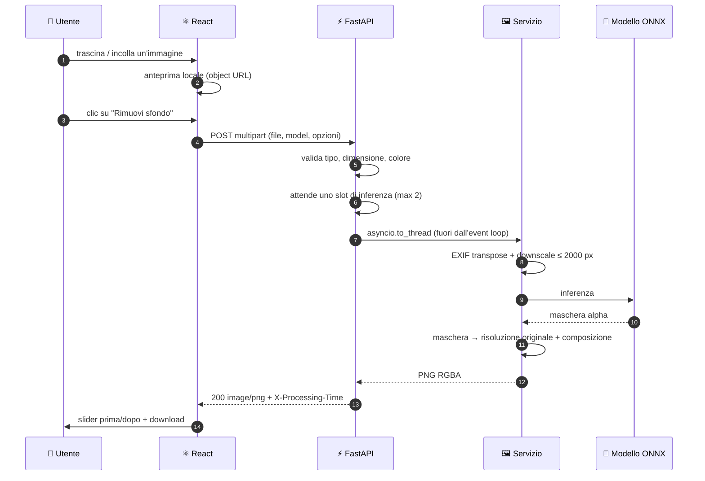

# 🔌 API

Quattro endpoint HTTP: puoi sostituire il frontend, incorporarlo in un'altra app o usare
l'API da sola. Il riassunto sta nel [README](../README.md#-api).

Documentazione interattiva (Swagger UI) su **http://localhost:8000/docs**.

## `POST /api/remove-background`

Corpo `multipart/form-data`:

| Campo | Tipo | Default | Descrizione |
| :-- | :-- | :-- | :-- |
| `file` | file | — | PNG, JPEG, **HEIC/HEIF**, WEBP, BMP, TIFF o AVIF · max 15 MB e 50 Mpixel |
| `model` | string | `u2net` | uno degli id restituiti da `/api/models` |
| `edges` | string | `hard` | `hard` squadra la maschera, `soft` la lascia sfumata togliendo l'alone, `max` usa l'alpha matting |
| `erode` | int | `0` | restringe la maschera di N pixel (0-10): mangia l'anello di sfondo rimasto sul contorno |
| `feather` | float | `0` | sfuma il contorno con un raggio di N pixel (0-20) |
| `background` | string | — | colore esadecimale (`#fff`, `#ffffff`, `#ffffffaa`); se assente lo sfondo resta trasparente |
| `format` | string | `png` | `png` (senza perdita) o `webp` (molto più leggero) |
| `trim` | bool | `false` | ritaglia il risultato al riquadro del soggetto |

**Risposta** `200 image/png`, più gli header `X-Processing-Time` (secondi),
`X-Image-Width` e `X-Image-Height`.

```bash
# sfondo trasparente
curl -F "file=@foto.jpg" http://localhost:8000/api/remove-background -o out.png

# sfondo bianco, modello per ritratti, bordi rifiniti
curl -F "file=@ritratto.jpg" -F "model=u2net_human_seg" -F "background=#ffffff" \
     -F "edges=max" http://localhost:8000/api/remove-background -o tessera.png
```

<details>
<summary>Lo stesso da Python, con <code>requests</code></summary>

```python
import requests

with open("foto.jpg", "rb") as f:
    r = requests.post(
        "http://localhost:8000/api/remove-background",
        files={"file": ("foto.jpg", f, "image/jpeg")},
        data={"model": "u2net", "edges": "soft"},
        timeout=120,
    )
r.raise_for_status()
open("out.png", "wb").write(r.content)
print(r.headers["X-Processing-Time"], "secondi")
```
</details>

**Errori** — sempre JSON nella forma `{"detail": "..."}`, con `detail` sempre stringa
(anche per gli errori di validazione, che FastAPI restituirebbe come lista di oggetti):

| Codice | Quando |
| :-- | :-- |
| `400` | file vuoto, immagine illeggibile, modello, colore o formato non valido |
| `413` | file oltre il limite di upload, oppure immagine oltre `RB_MAX_IMAGE_PIXELS` |
| `415` | content-type non supportato |
| `422` | richiesta malformata: campo mancante o non interpretabile |
| `500` | errore inatteso durante l'elaborazione (loggato lato server) |
| `503` | coda di inferenza satura oltre `RB_QUEUE_TIMEOUT`; la risposta include `Retry-After` |

## `POST /api/remove-background/batch`

Stesso corpo dell'endpoint singolo, ma con il campo `files` ripetuto per ogni immagine, e
in risposta uno **ZIP** (`application/zip`) con gli header `X-Processed` e `X-Skipped`.

```bash
curl -F "files=@a.jpg" -F "files=@b.jpg" -F "format=webp" \
     http://localhost:8000/api/remove-background/batch -o senza-sfondo.zip
```

Dentro l'archivio, oltre alle immagini, un `manifest.json` lega ogni risultato alla foto di
partenza (i nomi vengono normalizzati e deduplicati, quindi da soli non basterebbero). Un
file che fallisce non annulla il resto — finisce in `errori.txt` — e la richiesta fallisce
con `400` solo se non è riuscita nemmeno un'immagine. Ogni immagine passa per uno slot di
inferenza separato, così un blocco lungo non monopolizza il server, e se chi ha inviato
chiude la pagina l'elaborazione si ferma. Lo ZIP viene composto in memoria, per non
scrivere le foto su disco: da qui i tetti `RB_MAX_BATCH_FILES` e `RB_MAX_BATCH_BYTES`.

> [!NOTE]
> L'interfaccia **non** usa questo endpoint: elabora le immagini una alla volta con quello
> singolo, per mostrare a che punto è ("3 di 10") e dare ogni risultato appena è pronto —
> lo ZIP finale lo compone il browser. Questo endpoint serve a chi usa l'API da script.

## `GET /api/models` · `GET /api/health`

Rispettivamente l'elenco dei modelli — descrizione, peso, risoluzione d'ingresso e se sono
già sul disco — e lo stato del servizio con i limiti in vigore (`status`, `default_model`,
`limits`), quelli che l'interfaccia usa per avvisare prima di inviare un file troppo grande.


---

## Anatomia di una richiesta

Cosa succede fra il drop del file e il PNG che torna indietro.


