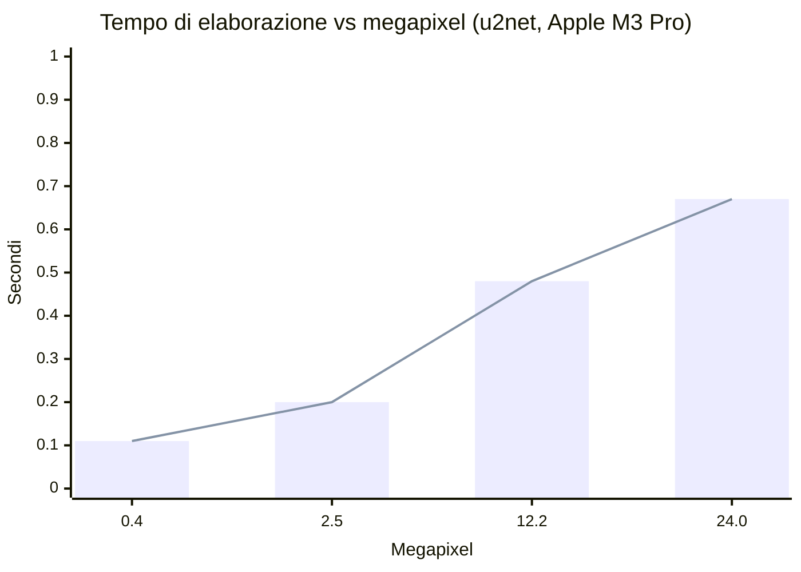

# 📊 Prestazioni, misure e memoria

Tutte le cifre di questa pagina sono misurate, non stimate: Apple M3 Pro, CPU, mediana di
3 esecuzioni dopo il warm-up, salvo diversa indicazione. Il riassunto sta nel
[README](../README.md#-prestazioni).

---

## Come scala con i megapixel

Le reti di segmentazione lavorano internamente a bassa risoluzione (320×320 per la famiglia
u2net): l'inferenza gira su una **copia ridotta** — lato lungo ≤ 2000 px — e la maschera
torna poi alla dimensione di partenza. Colore e dettagli arrivano sempre dai pixel
originali, a essere ridimensionata è solo la maschera. Per questo il costo cresce **molto
meno che linearmente** con i megapixel: a scalare è il lavoro sui pixel, non l'inferenza.

(La tabella con i tempi sta nel [README](../README.md#-prestazioni).)

Immagini sintetiche ad alto dettaglio, il caso peggiore per la codifica. I file sono
piccoli perché sotto i pixel trasparenti non resta nulla da comprimere: vedi sotto.

## Quanto costa ogni opzione

Sulla stessa foto da 12 MP, rispetto al comportamento predefinito:

| Opzione | Effetto sul tempo | Effetto sul file |
| :-- | :-- | :-- |
| **Formato WEBP** | 0,48 s → 0,82 s | 1,30 MB → **0,15 MB** |
| **Ritaglio ai bordi** (`trim`) | trascurabile | taglia i margini vuoti attorno al soggetto |
| **Bordi morbidi** (`edges=soft`) | 0,48 s → 0,72 s | 0,20 MB → 0,33 MB |
| **Massima qualità** (`edges=max`) | 0,53 s → **1,07 s** | invariato |
| **Rifinitura** (`erode=2`, `feather=3`) | +0,50 s | invariato |
| **Acceleratore CoreML** | inferenza 0,40 s → **0,21 s** | invariato |

La riga dei bordi morbidi è misurata su una foto con un soggetto definito: sull'immagine
sintetica usata per le altre righe la maschera esce sfumata quasi ovunque e il confronto
perderebbe senso.

**I tre livelli sono gradini della stessa scala**, non interruttori indipendenti: `soft`
smette di squadrare la maschera e toglie l'alone, `max` aggiunge sopra l'alpha matting.

Sopra i tre livelli agisce la **rifinitura** (`erode` e `feather`), che lavora sulla
maschera già a piena risoluzione: `erode` toglie l'ultimo anello di pixel — quello che
spesso conserva un residuo di sfondo — e `feather` ammorbidisce il passaggio. Costano
poco entro valori normali, ma crescono in fretta: a 12 MP `erode=10` con `feather=20`
arriva a 2,4 s.

**Cosa cambia togliendo l'alone.** Con la maschera squadrata i contorni sono netti
ma a scaletta; lasciandoli sfumati i pixel misti conservano un velo del vecchio sfondo — su
un fondale verde acceso, misurato, una frangia di **+28 su 255** di verde in eccesso. Con
`edges=soft` il colore reale del soggetto viene stimato e riportato su quella fascia:
l'eccesso scende a **−5**, cioè sparisce. Vale anche per `edges=max`, che prima
produceva bordi sfumati con i colori contaminati.

Il WEBP resta otto volte più leggero, ma **non più veloce**: da quando i pixel invisibili
vengono azzerati, il PNG ha pochissimo da comprimere e la codifica è la metà. Quando conta
il peso — un blocco da dieci foto occupa 10,5 MB in PNG e 1,5 in WEBP — la scelta resta il
WEBP, che sui pixel visibili differisce di 0,33 su 255 e tiene il canale alpha identico bit
per bit.

> [!IMPORTANT]
> CoreML si paga in memoria: **881 MB a riposo contro 414 MB** su CPU, il doppio abbondante
> per guadagnare 0,25 s a immagine. Con poca RAM, o quando conta quanti processi ci stanno,
> conviene `RB_ACCELERATION=0`. Nei contenitori Linux la scelta non si pone.

## Sotto la trasparenza non resta niente

In un PNG anche i pixel invisibili hanno un colore. Lasciandoci lo sfondo originale — come
fa la maggior parte degli strumenti — quel colore **è ancora nel file**: basta rimettere
l'opacità a 255 per rivedere la stanza da cui hai ritagliato il soggetto. Qui viene azzerato:

| | File PNG | Tempo |
| :-- | --: | --: |
| Con lo sfondo lasciato sotto | 19,17 MB | 1,24 s |
| Azzerato (predefinito) | **1,21 MB** | **0,46 s** |

Quindici volte più leggero e la metà del tempo, senza toccare un solo pixel visibile: la
compressione lavora su una distesa uniforme invece che su una fotografia. Si disattiva con
`RB_CLEAR_INVISIBLE=0`, utile solo se usi il ritaglio come texture in programmi che
ignorano il canale alpha.

## Risoluzione del modello, non dell'immagine

La tabella dei modelli, con peso e tempi, sta nel
[README](../README.md#quale-modello). Il punto che conta è la loro **risoluzione
d'ingresso**: su una foto con 200 ciocche sottili, `u2net` (320 px) risolve 10.636 pixel di
ciocca, `isnet-general-use` (1024 px) **365.599** — trentaquattro volte tanto, per il 46%
di tempo in più.

> [!NOTE]
> Alzare la risoluzione della copia di lavoro **non aiuta**: la rete ridimensiona comunque
> al proprio ingresso. Misurato, passare da 2000 a 4000 px cambia lo 0,09% dei pixel della
> maschera e con l'alpha matting triplica il tempo per lo 0,10%. Se servono contorni più
> fini, si cambia modello, non risoluzione.

Apple M3 Pro · CPU · immagine 1920×1280 con texture · mediana di 3 esecuzioni dopo il
warm-up. L'alpha matting serve su capelli, pelo e tessuti sottili; sui bordi netti non
cambia il risultato.

> [!NOTE]
> Il limite di 15 MB sull'upload non protegge da niente: un PNG di **388 KB** può
> decodificare 121 Mpixel e occupare ~900 MB di RAM. Il controllo vero è
> `RB_MAX_IMAGE_PIXELS` (50 Mpixel), verificato sull'intestazione del file prima che i pixel
> vengano allocati: richieste simili vengono respinte con `413` in pochi millisecondi e a
> memoria invariata.

---

## Quanta RAM serve

Ogni inferenza in corso costa ~500 MB su una foto da 12 MP, e il picco non viene più
restituito al sistema operativo: a contare è il **massimo simultaneo**, non la media. Per
questo `RB_MAX_CONCURRENCY` limita le inferenze parallele; le richieste in eccesso
aspettano il turno e ricevono `503` solo se la coda non si smaltisce entro
`RB_QUEUE_TIMEOUT`.

| Carico (foto da 12 MP) | RSS del processo |
| :-- | --: |
| A riposo, con `u2net` caricato | 410 MB |
| 1 inferenza in corso | 824 MB |
| 2 in corso (il default) | 1,46 GB |
| 12 richieste insieme, `RB_MAX_CONCURRENCY=2` | **1,59 GB** |
| 12 richieste insieme, senza freno | **4,65 GB** |

Le stesse 12 richieste, tutte servite con esito `200` in entrambi i casi: il freno scambia
**un terzo della memoria** con il doppio del tempo di smaltimento della coda (10,1 s contro
4,3 s). Regola pratica: `RB_MAX_CONCURRENCY=1` sotto i 2 GB di RAM, il default `2` fino a
4 GB, oltre si può alzare.
